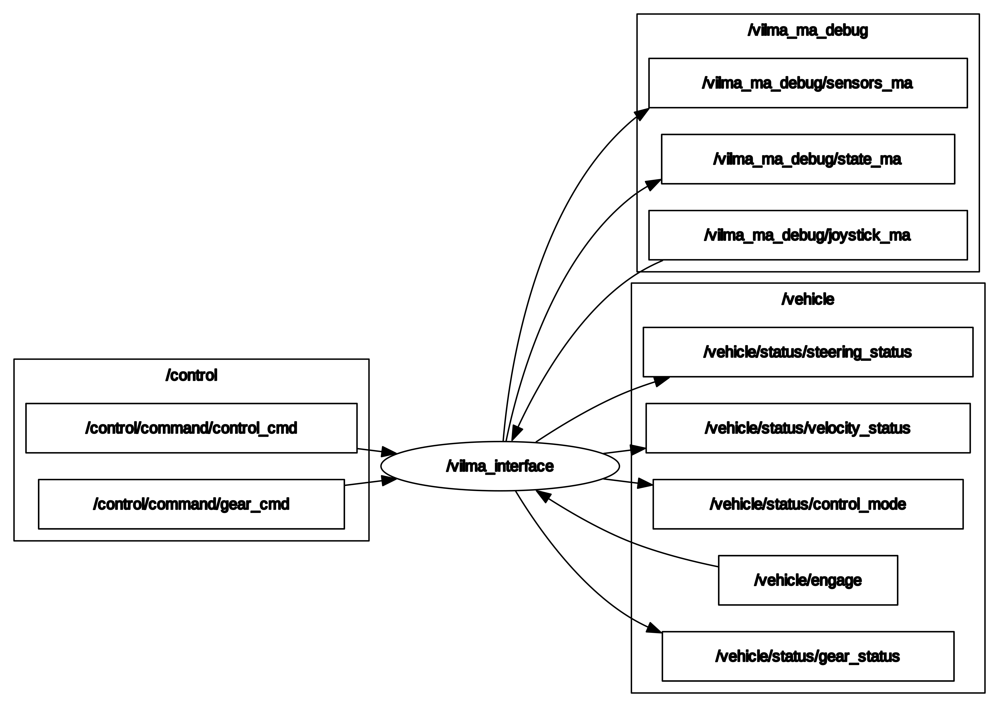
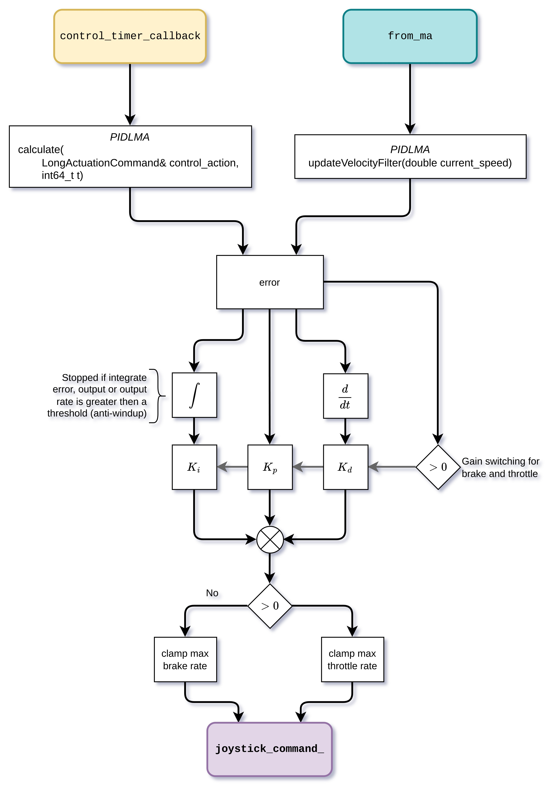

# vilma_interface: Autoware Vehicle Interface for VILMA

## Architecture

  

### ROS Graph

  

## TON Filter

TON Filter is a retarder filter that act as a TON relay, where if the input is `True` for more them TON time to trigger, it is activated.

## Longitudinal Control

  

